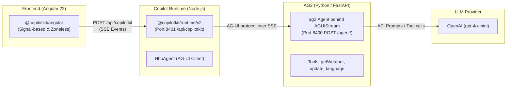

### Project Overview

This project is an **interactive test harness and demonstration suite** for validating the integration between **CopilotKit** (Angular client + Node runtime) and **AG2** (Python / FastAPI, `ag2[ag-ui]`).

The repository serves two main purposes:

1. **Interactive Demo & QA Harness**: A running Angular 22 web application that implements and tests every feature of `@copilotkit/angular` against a live AG2 backend.
2. **Living Documentation Verifier**: Mirrors the official documentation found in [doc-snapshot/](doc-snapshot), ensuring that code snippets shown in docs are byte-identical to actual executing code.

---

### Architecture Overview

Unlike traditional single-backend architectures, this project uses a **3-tier distributed model**:



1. **Frontend (Browser - Angular 22)**:
   - Configured in [app.config.ts](frontend/src/app/app.config.ts) using `provideCopilotKit({ runtimeUrl: 'http://localhost:8401/api/copilotkit' })`.
   - Never exposes OpenAI keys directly to the browser.
   - Built with modern Angular conventions: signal-based reactivity, standalone components, native control flow (`@if`, `@for`), and Tailwind CSS v4.

2. **Copilot Runtime Proxy ([frontend/server.ts](frontend/server.ts))**:
   - Runs on **port 8401** as a standalone Node.js server using `@copilotkit/runtime/v2`.
   - Registers two agent aliases (`default` and `support`) pointing to the AG2 agent at `http://localhost:8400/agent/` via `@ag-ui/client`'s `HttpAgent`.
   - Enables `a2ui: {}` middleware across all registered agents.

3. **Backend Agent ([backend/main.py](backend/main.py))**:
   - Runs on **port 8400** via FastAPI and Uvicorn.
   - Powered by `ag2[ag-ui,openai]`: an `ag2.Agent` wrapped in `AGUIStream` and mounted with `app.mount("/agent", stream.build_asgi())`, the shape the AG2 quickstart uses.
   - Exposes `getWeather` and `update_language`, and carries a `language` context variable — which is what AG2 publishes as AG-UI shared state.

---

### Directory Structure

```
AG2-angular/
├── project-context.md          # Rules & ground truth for doc-project parity
├── prior-testing/report.md     # The earlier manual pass's page-level verdicts
├── doc-snapshot/               # Versioned upstream documentation snapshots
│   ├── manifest.json           # SHA256 checksums & route mappings
│   ├── CHANGELOG.md            # Doc drift history
│   ├── reports/                # Timestamped diff analysis reports
│   └── pages/                  # Tracked official guide markdown files
├── backend/                    # Python / AG2
│   ├── pyproject.toml          # uv-managed dependencies (FastAPI, ag2[ag-ui,openai])
│   ├── uv.lock
│   └── main.py                 # FastAPI app, agent tools, AG-UI endpoint
├── autorecorder/               # Per-page demo capture (doc → code → live feature)
└── frontend/                   # Angular 22 Application + Node Runtime
    ├── package.json            # npm scripts & dependencies
    ├── server.ts               # Copilot Runtime server (Node.js, Port 8401)
    ├── scripts/
    │   ├── generate-sources.ts # Syncs running source code into TypeScript strings
    │   ├── write-versions.ts   # VERSIONS.md — what the ranges actually resolved to
    │   └── sync-docs.ts        # Doc drift check & snapshot sync
    └── src/
        ├── styles.css          # Tailwind 4, CopilotKit CSS, and theme tokens
        └── app/
            ├── app.config.ts   # Root providers (provideCopilotKit, sandbox functions)
            ├── app.routes.ts   # Doc routes + isolated chrome-free /demo routes
            ├── components/     # App layout, health check, UI primitives
            ├── features/       # 11 isolated feature modules
            ├── lib/            # Nav configuration & source code loader
            └── pages/          # 14 routed doc & overview pages
```

There is no `ci/` directory yet. The steps it automates in the sibling repos are
individually runnable here — see the scripts in the root `package.json`.

---

### Feature Modules & Implementation Status

The project defines each feature area in [nav-config.ts](frontend/src/app/lib/nav-config.ts) and displays status in [status.ts](frontend/src/app/pages/status.ts):

| Feature Area | Route | Description | Status |
| :--- | :--- | :--- | :--- |
| **Quickstart** | [/quickstart](frontend/src/app/pages/quickstart.ts) | Baseline chat integration with `provideCopilotKit` and `<copilot-chat />` | `Working` |
| **Chat UI & Theming** | [/chat-ui](frontend/src/app/pages/chat-ui.ts) | Embedded, sidebar, and popup surfaces + custom message components | `Working` |
| **Frontend Tools & Gen UI** | [/frontend-tools-generative-ui](frontend/src/app/pages/frontend-tools-generative-ui.ts) | Server-side tools rendered in Angular, browser-side tools, sandboxed Open Generative UI | `Working` |
| **Human-In-The-Loop** | [/human-in-the-loop](frontend/src/app/pages/human-in-the-loop.ts) | `registerHumanInTheLoop` confirmation dialogs; interrupt panels | `Working` (tool path only — see Known issues) |
| **Shared State & Context** | [/shared-state](frontend/src/app/pages/shared-state.ts) | `injectAgentStore` and contextual metadata injection | `Broken` (writes dropped — see Known issues) |
| **Attachments** | [/attachments](frontend/src/app/pages/attachments.ts) | File picker, drag-and-drop, clipboard image pasting | `Working` |
| **Headless UI** | [/headless](frontend/src/app/pages/headless.ts) | Custom transcript and composer from `injectAgentStore` & `runAgent` | `Working` |
| **A2UI (Adaptive UI)** | [/a2ui](frontend/src/app/pages/a2ui.ts) | Declarative UI driven by runtime A2UI middleware | `Broken` (no catalog definition) |
| **Voice & Multimodal** | [/voice-multimodal](frontend/src/app/pages/voice-multimodal.ts) | Voice recording controls and multimodal payload generation | `Broken` (no transcription service wired) |
| **Threads & Memory** | [/threads](frontend/src/app/pages/threads.ts), [/memory](frontend/src/app/pages/memory.ts) | Multi-turn thread management and persistent agent memories | `Partial` (Requires CopilotKit Intelligence license) |

The earlier manual pass's verdicts are in [prior-testing/report.md](prior-testing/report.md). This
table agrees with it except on Attachments, which that pass marked ❌ as part of
the four-topic page and which does reach the model here — see Known issues for
what does fail on that page.

---

### Known issues

Everything below was reproduced against the versions in `frontend/VERSIONS.md`.

**1 · The quickstart never shows an AG2 backend.**
`/angular/ag2/quickstart` ships the literal string
`<!-- setup skipped: agent-setup is not bundled for ag2 -->` where the backend
step belongs, then tells the reader to "Continue with the selected backend's
Copilot Runtime guide" — which is the generic `BuiltInAgent` page and says
nothing about AG2. A reader following the Angular AG2 path end to end is never
shown a line of AG2 code. `backend/main.py` here was written from
[ag2ai/ag2-samples](https://github.com/ag2ai/ag2-samples) instead, which the
Angular docs never link.

**2 · The runtime URL needs a trailing slash, and nothing says so.**
`AGUIStream.build_asgi()` is mounted with Starlette's `app.mount`, which serves
its path only with the slash: `POST /agent` answers `307` with a `Location` of
`/agent/`. `HttpAgent` posts and does not re-post, so the run dies with
`RUN_ERROR: fetch failed` and no indication of why. `frontend/server.ts` uses
`http://localhost:8400/agent/`.

**3 · `agent.setState` is silently dropped.**
The Shared state guide's central claim — "Agent and application both read and
write the value" — does not hold on AG2. `ag2/ag_ui/stream.py` merges the
incoming AG-UI state *under* the agent's own variables:

```python
initial_state = (command.incoming.state or {}) | initial_vars
```

so any key the agent declares wins and the browser's value is discarded.
Verified: posting `state: {"language": "spanish"}` to an agent whose variables
say `english` runs as `english`, and the first `STATE_SNAPSHOT` echoes `english`
back. Reads work; writes do not.

**4 · There is no `STATE_DELTA`.**
The AG-UI bridge emits `STATE_SNAPSHOT` once before the run and once after it,
and only if the variables changed. State never moves *during* a run, so a UI
built to watch it stream sits still until the run ends.

**5 · Interrupts cannot fire at all.**
Half the Human-in-the-loop page is `injectInterrupt` and
`store().interruptController`. `ag2/ag_ui/stream.py` imports no interrupt event
type and no custom event type, so no AG2 agent can emit one. This is not "idle
until you configure it" — it is unreachable on this backend, and the page does
not say so. The `registerHumanInTheLoop` half does work: a tool sent in
`RunAgentInput.tools` comes back as a `TOOL_CALL_CHUNK` that ends the run for
the browser to answer.

**6 · The generative-UI card reads an argument the tool does not have.**
The guide's `WeatherCardComponent` reads `call.args.city` throughout, while the
tool parameter it binds to is `location`. The name matches, so the renderer
mounts; the heading renders empty and the loading line falls through to its
placeholder. The page never states the argument contract it depends on.

**7 · A malformed AG-UI request is an opaque 500.**
`build_asgi` validates `RunAgentInput` before it opens the stream, so a bad
request never becomes a `RUN_ERROR` event — the browser gets
`500 Internal Server Error` with no body and the traceback stays in the server
log.

**8 · A2UI is inert without a catalog.**
`/api/copilotkit/info` reports `a2uiEnabled: true`, but supplying `a2ui.catalog`
is what actually registers the `render_a2ui` renderer, and the guide's catalog
snippet is not self-contained. Unchanged from the sibling harnesses — this one
is a CopilotKit issue, not an AG2 one.

**9 · The Angular guide pages are not AG2 pages.**
All ten pages under `/angular/ag2` are byte-identical to the ones under
`/angular/ms-agent-python` once the slug is normalised. Findings 3, 4 and 5
are direct consequences: the pages describe capabilities of a different
backend.

---

### How to Run the Project

#### 1. Backend (AG2)

```bash
cd backend
# Requires Python 3.10–3.14 and uv
uv sync
uv run main.py
# Runs on http://localhost:8400, agent at POST /agent/
```

_Note: `OPENAI_API_KEY` must be set in `backend/.env` — see `backend/.env.example`._

#### 2. Copilot Runtime & Angular Frontend

```bash
cd frontend
npm install

# Option A: Run runtime and frontend concurrently
npm run dev

# Option B: Run separately
npm run runtime    # Starts Copilot Runtime on http://localhost:8401
npm start          # Starts Angular Dev Server on http://localhost:4204
```

Ports differ from the docs on purpose. The quickstart puts the runtime on 8400;
the AG2 backend binds that, so the runtime moved to 8401 and `ng serve` to 4204.
That is what lets this stack run beside the Agno, Mastra and MsPy harnesses in
this workspace without either having to move. Override with `PORT`,
`AG2_AGENT_URL` and `FRONTEND_URL`.

#### 3. Automated Screen Recording & Demonstration Suite

Lives in [autorecorder/](autorecorder) — a portable suite shared across CopilotKit
framework repos and adapted to this one through `config/` and `actions/` only.
See [autorecorder/README.md](autorecorder/README.md) for the full contract.

Each page gets one video in three steps: the official doc page, a simulated VS
Code showing this repo's own source at the relevant lines, then the chrome-free
`/demo` route driven live.

Once the backend (`8400`), runtime (`8401`), and frontend dev server (`4204`) are running:

```bash
cd autorecorder
npm install
npx playwright install chromium

npm run doctor            # validate the configuration (exits 1 on error)
npm run doctor:online     # also probe every doc/demo URL and the selectors
npm run record -- --list  # what will be recorded

# Record all pages in nav order
npm run record

# Record a specific page individually
npm run record -- --quickstart
npm run record -- --page=chat-ui
npm run record -- --filter=threads

npm run mux               # put the voiceover tracks on the clips (needs ffmpeg)
npm run manifest          # record each clip's date, hash, and staleness
```

Recordings are saved to `autorecorder/videos/AG2-angular-<NN>-<Name>.webm`.
That folder is gitignored: videos are build output. `manifest.json` and
`MANIFEST.md` beside them are not — their diff is the only record of what a run
changed.

##### The clips are findings, not feature tours

`project-context.md` is explicit that a clean run against broken docs is a
failed run, and that broken pages keep their broken implementation because "the
clip exists to show the defect". A video of a feature not working is, on its
own, indistinguishable from a video of a recorder that mis-clicked — so eight of
the twelve pages end the same way:

1. drive the feature until the defect actually happens on screen
2. rest the cursor on the evidence, long enough to read it
3. open a Notepad window and type the finding out at human speed
4. hold, then close — the evidence still visible behind all of it

The note format is shared (`actions/finding-note.ts`) so twelve clips read as
one report rather than as twelve people guessing: *what happened* (observable
only), *why* (naming the file or symbol), and *what the doc does not say* —
which is the actual deliverable, since rule 3 of `project-context.md` counts
ambiguity as a defect.

Three demonstrations are worth knowing about before watching:

- **Shared state** runs three turns, and the third is a control. Two state
  writes are dropped, then a *context* write lands — same page, same agent, same
  run. That rules out "the backend is down" on screen, before the note claims
  anything.
- **Human-in-the-loop** runs the working half first. The viewer watches the
  agent genuinely pause and resume for a human decision, and only then travels
  up to the two interrupt panels that sat empty through all of it.
- **Frontend tools** reads the weather card's heading out of the DOM and logs
  it, because the defect is a single blank field on an otherwise perfect card.
  Left to the eye, that page records as a clean pass — exactly the "silent
  failure" `project-context.md` lists as a gap the pipeline misses.

Two pages carry a note saying nothing is wrong: **Memory** and **Threads** are
premium-gated, and both notes say so in as many words. A report that marks four
pages red without separating "the docs are wrong" from "you have not paid for
this" is a report nobody can act on.

#### 4. Documentation Drift & Sync

To verify that the project documentation snapshots remain byte-identical with live upstream docs at `https://docs.copilotkit.ai/angular/ag2`:

```bash
npm run drift          # check for doc drift without modifying files
npm run drift:sync     # synchronize snapshots, manifest, changelog, diff reports
```

---

### Continuous integration

Three workflows, split so each red light means exactly one thing. One workflow
covering all three would go red for "you broke the build", "CopilotKit edited a
page" and "a clip failed to capture", which teaches everyone to ignore it.

| Workflow | Trigger | A red run means |
| :--- | :--- | :--- |
| [`verify.yml`](.github/workflows/verify.yml) | push, PR | someone broke the code in this repo |
| [`doc-drift.yml`](.github/workflows/doc-drift.yml) | nightly 05:31 UTC, dispatch | upstream edited a doc page; the harness now demonstrates something the docs no longer say |
| [`record.yml`](.github/workflows/record.yml) | dispatch | a clip failed to capture what it was meant to |

**`verify.yml`** — no secrets, no browser, no model calls, about two minutes.
Frontend generates, typechecks and builds. Backend runs `uv sync --locked` and
then *imports* the agent, which constructs it, resolves both `@tool` schemas
through `fast_depends` and mounts the `AGUIStream` — most ways of breaking
`main.py` fail right there rather than at request time. Recorder typechecks and
runs the static doctor.

It also closes two gaps `project-context.md` lists as things the pipeline
misses:

- `generated-sources.ts` is regenerated and the run fails if it differs from
  the committed copy. A stale map means every recording taken against it showed
  code that is no longer running.
- `autorecorder/consistency.ts` compares the app's `hasDemo` routes against the
  recorder's page registry, in both directions. A guide route added without a
  recorder entry is otherwise dropped from every future run in silence.
  Runnable locally the same way CI runs it: `npm run record:consistency`.

**`doc-drift.yml`** deliberately does not auto-commit the refreshed snapshot.
Drift is the finding; folding it into a bot commit would silently re-baseline
the harness to a page nobody read. `npm run drift:sync` is the human step, and
it writes the CHANGELOG entry the QA report cites.

**`record.yml`** needs an `OPENAI_API_KEY` repository secret and says so in its
first step, rather than recording twelve videos of a dead chat. It brings up all
three processes, waits on each with its own health check, runs the online
doctor, records under `xvfb` (`core/engine.ts` launches `headless: false`, so a
virtual display is not optional), muxes the narration, writes the manifest and
uploads the clips. Its nightly cron is written but commented out — every run
spends model tokens on twelve pages, so switching it on should be a decision.

What a green `record.yml` means is worth stating plainly, because it is not the
obvious thing: **not that the features work**. Eight of the twelve pages are
recorded to demonstrate a defect. Green means every clip captured what it was
supposed to — including the empty A2UI surface, the dropped state write, and the
interrupt panels that never fire.

#### Watching what CI recorded

The clips are gitignored, so after a CI run the artifact is the only complete
set that exists. Pull one down:

```bash
npm run ci:videos              # newest completed run
npm run ci:videos -- --list    # what is downloadable
npm run ci:videos -- 33477092124
```

They land in `autorecorder/videos/ci-<run-id>/`, beside the local clips rather
than on top of them. The folder carries its own provenance, so two runs can be
compared against each other and against a local recording — and a folder found a
week later still says which run made it.

---

### Upgrading Packages

#### Frontend (Angular / npm)

```powershell
git checkout -b chore/bump-<package>
npm --prefix frontend install <package>@<version>
git diff frontend/package-lock.json   # one bump can drag in dozens of transitives
npm --prefix frontend run build
```

Then record the affected pages before merging — verifying the docs still run is
what this repo is for. Revert with
`git checkout frontend/package-lock.json; npm ci`.

Two things not to do:

- **`npx npm-check-updates -u`** rewrites `package.json` to the newest release of
  everything, ignoring the ranges. It bumps all twelve `@angular/*` packages past
  Angular's exact inter-package peer requirements, leaving the tree
  unsatisfiable.
- **`npm install --legacy-peer-deps`** does not fix a peer conflict, it hides
  one. The error it silences is the signal that the combination being installed
  was never meant to work together — precisely what this harness reports on.

Note that `@copilotkit/angular` exact-pins `@copilotkit/core`, and Angular 22
requires `typescript >=6.0 <6.1` — so TypeScript reads a full major behind and
must stay there.

#### Backend (Python / uv)

```powershell
cd backend
uv lock --upgrade
uv sync
```

This moves `uv.lock` to the newest versions `pyproject.toml` already allows.
Raising a floor in `pyproject.toml` follows the same branch-and-verify path as
the frontend.

After either, regenerate the file the Quickstart clip puts on screen:

```bash
npm run versions
```
